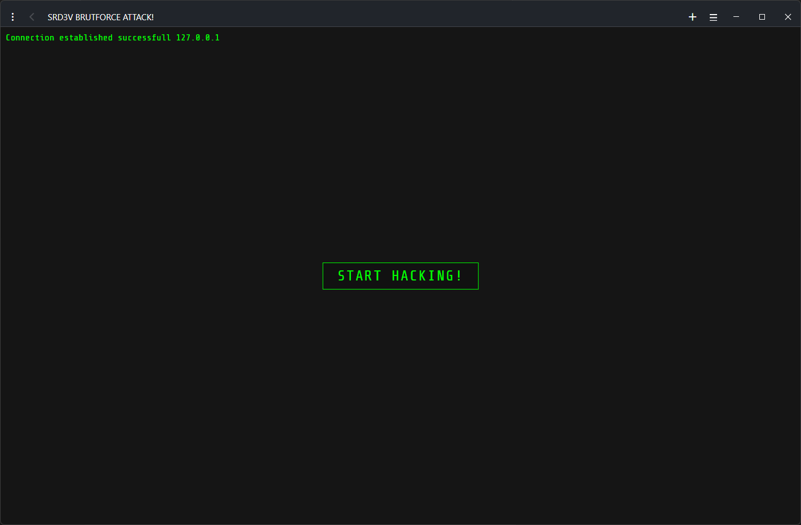
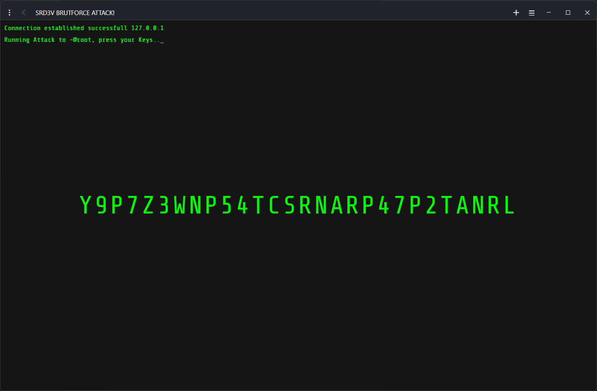
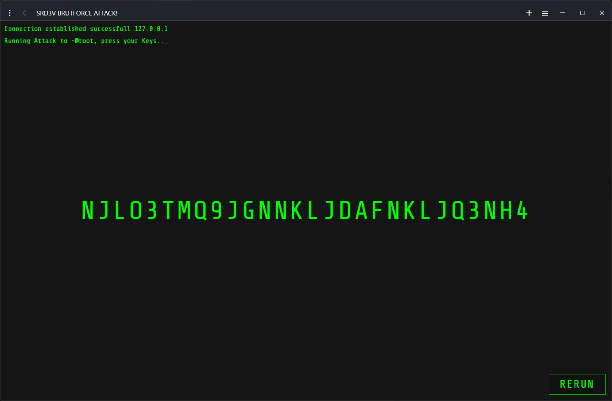

# Bruteforce Template

Dies ist ein Projekt, das eine einfache Webseite mit HTML, CSS und JavaScript enthält. Die Hauptdateien des Projekts sind `index.html`, `style.css` und `script.js`.

## Beschreibung

In diesem Repository befindet sich eine einfache, rein visuelle Bruteforce-Webseite – also eine Fun Application ohne echte Funktion. Die Seite simuliert einen Bruteforce-Angriff im Browser, basiert aber ausschließlich auf statischen Webtechnologien (HTML, CSS, JS) und dient nur zu Unterhaltungszwecken.

## Screenshot





## Installation

1. Klone das Repository:
   ```bash
   git clone https://github.com/SRD3V/web-templates/bruteforce-template.git
